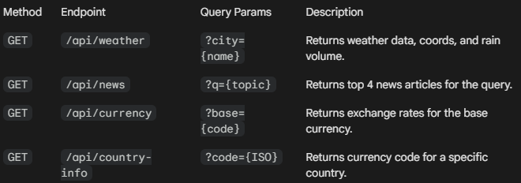
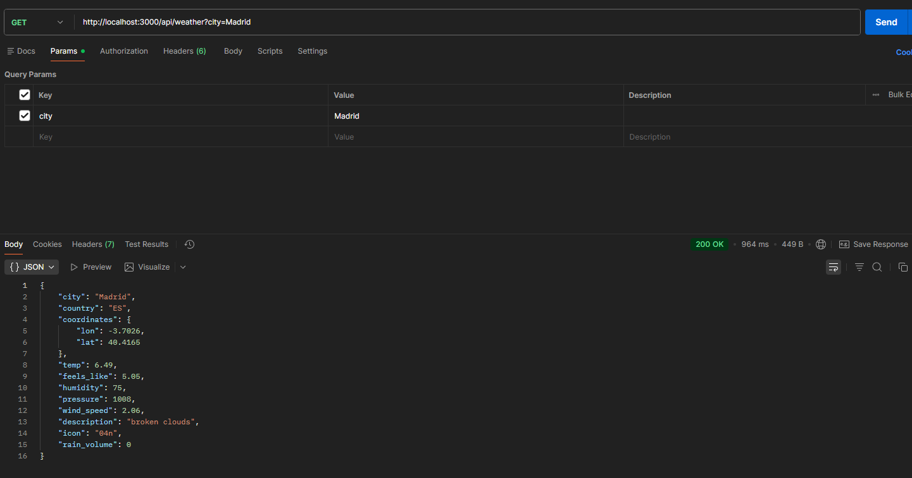
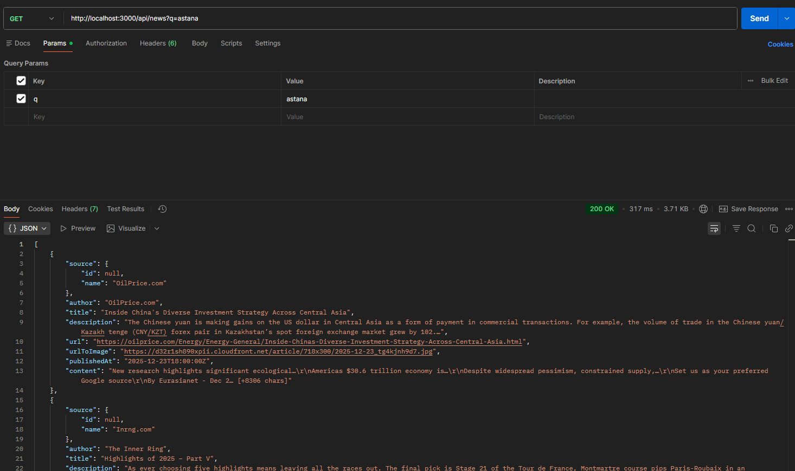
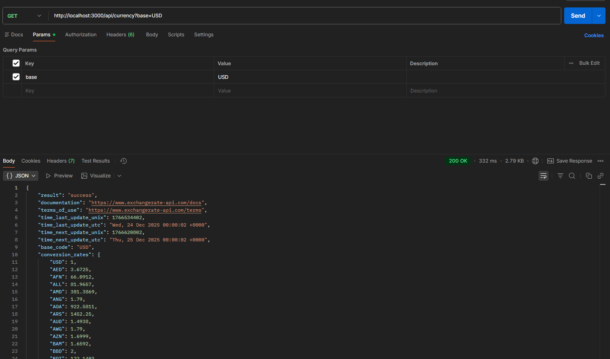
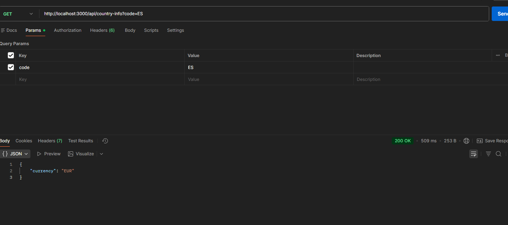
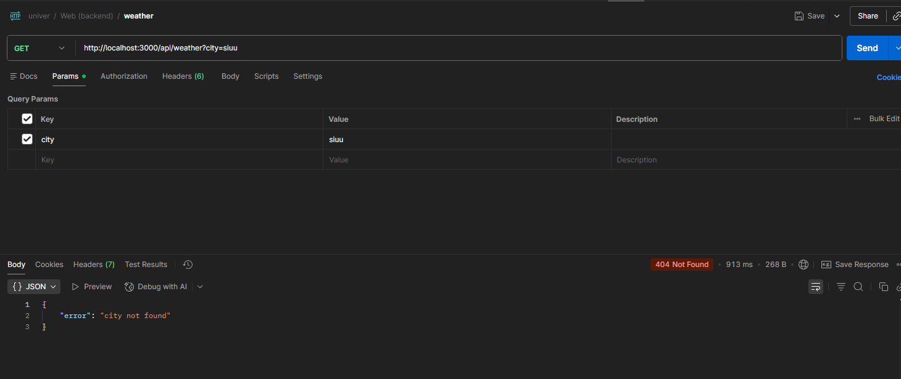

# 🌍 CITY INFO

**CityScope** is a comprehensive single-page web application that allows users to explore any city in the world. It provides real-time weather data, interactive mapping, local news headlines, and an intelligent currency converter that automatically detects the local currency of the searched city.

This project was developed to demonstrate mastery of **API integration**, **backend proxying**, and **responsive frontend design**.

## Features

### 1. 🌤 Real-Time Weather

- Fetches live data from **OpenWeatherMap API**.
- **Data Points:** Temperature, Feels Like, Humidity, Pressure, Wind Speed, Country Code, Coordinates.
- **Special Feature:** Explicitly handles **Rain Volume (last 3h)** detection.
- Displays dynamic weather icons.

### 2. 🗺 Geolocation & Mapping

- Visualizes the searched city using **Leaflet.js** (OpenStreetMap).
- Automatically centers and zooms on the specific coordinates returned by the weather API.

### 3. 📰 Local News

- Integrates **NewsAPI** to fetch the latest headlines related to the search query (City/Region).
- Displays article thumbnails, titles, and publication dates.
- Includes a fallback mechanism for articles missing images.

### 4. 💱 Smart Currency Converter

- **Auto-Detection:** Uses the **REST Countries API** to identify the currency code (e.g., `JPY`) based on the weather's country code (e.g., `JP`).
- **Exchange Rates:** Uses **ExchangeRate-API** to perform real-time conversions.
- User-friendly interface with visual feedback (green flash) when the currency is auto-selected.

---

## 🛠 Tech Stack

- **Frontend:** HTML5, CSS3 (CSS Grid/Flexbox), JavaScript (ES6+), Leaflet.js
- **Backend:** Node.js, Express.js
- **Utilities:** Axios (HTTP requests), Dotenv (Environment variables)

---

## ⚙️ Installation & Setup

### 1. Prerequisites

Ensure you have **Node.js** installed on your machine.

### 2. Clone/Download

Extract the project files to a folder (e.g., `city-info`).

### 3. Install Dependencies

Open your terminal in the project folder and run:

```bash
npm install
```

### 4. Configure Environment Variables

Create a file named .env in the root directory. Paste your API keys inside:

```
PORT=3000
# Get key: [https://openweathermap.org/api](https://openweathermap.org/api)
WEATHER_API_KEY=your_openweather_key_here

# Get key: [https://newsapi.org/](https://newsapi.org/)
NEWS_API_KEY=your_news_key_here

# Get key: [https://www.exchangerate-api.com/](https://www.exchangerate-api.com/)
EXCHANGE_API_KEY=your_currency_key_here
```

### 5. Run the Server

Start the backend server:

```
node server.js
```

### 6. Access the App

Open your browser and navigate to:
http://localhost:3000

## API Documentation (Backend Endpoints)

The frontend never calls external APIs directly. It communicates with server.js, which acts as a secure proxy to hide API keys.



## Postman Testing

### 1. Test Weather Endpoint

Request: GET http://localhost:3000/api/weather?city=London

Verify: Status 200 OK. Response includes temp, rain_volume, coordinates.


### 2. Test News Endpoint

Request: GET http://localhost:3000/api/news?q=astana

Verify: Status 200 OK. Response is an array of articles.


### 3. Test Currency Endpoint

Request: GET http://localhost:3000/api/currency?base=USD

Verify: Status 200 OK. Response includes conversion_rates object.



### 4. Test Country's currency Endpoint

Request: GET http://localhost:3000/api/country-info?code=ES

Verify: Status 200 OK. Response includes country's currency.



### 5. Test Error Handling (Invalid Input)

Request: GET http://localhost:3000/api/weather?city=siuu

Verify: Status 404 Not Found. Response body: {"error": "city not found"}.



## Project Structure

```
apis integration/
│
├── .env                  # Environment variables (API Keys)
├── .gitignore            # Ignores node_modules and .env
├── server.js             # Main backend server entry point
├── package.json          # Project dependencies and scripts
├── README.md             # Project documentation
│
└── public/               # Frontend Static Files
    ├── index.html        # Main HTML structure
    ├── style.css         # Responsive styling (Grid/Flex)
    ├── app.js            # Frontend logic & API calls
```

## Key Design Decisions

### Server-Side Proxying:

**Decision:** All API calls are made from server.js rather than app.js.

**Reason:** This secures the API keys, preventing them from being exposed in the browser's "Network" tab (a crucial security best practice).

### Leaflet.js Implementation:

**Decision:** Used Leaflet instead of Google Maps.

**Reason:** Leaflet is open-source, free, and does not require a credit card for API access, meeting the project's requirement for a map visualization tool without unnecessary overhead.

### Dynamic Currency Detection:

**Decision:** Implemented a helper API (/api/country-info) using REST Countries API.

**Reason:** To enhance UX, the app automatically switches the currency converter to the local currency of the searched city (e.g., searching "Berlin" selects "EUR"), rather than forcing the user to select it manually.

### Rain Volume Handling:

**Decision:** Added specific logic in server.js to check data.rain['3h'].

**Reason:** The OpenWeather API omits the rain object entirely if the volume is 0. The backend standardizes this to ensure the frontend always receives a valid number (e.g., 0 mm) instead of undefined
